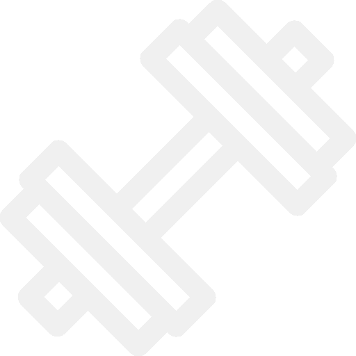

    
    <h1>Rep-Talk</h1>

  

    Rep-Talk is a fitness-focused forum website designed for content sharing, and user engagement within the fitness community. 
    The website's frontend is built with HTML, CSS and Javascript and the backend is build with Python, Flask and PostgreSQL.
  

  

    You can visit the live website <a href="www.rep-talk.com">here
  

<h2>Website Features</h2>

<h3>🔐 Account System</h3> 

The website allows users to register, log in and customize their profiles. User data is stored securely in a **PostgreSQL Database** 
where their passwords are salted and hashed using **Werkzeug**.

Sign up forms have data validators implemented to make sure users provide the requested information correctly, as well as information-retention
in case of wrong input to prevent negative user experience.

<h3>💬 Engagement Tools</h3>
  
Users can read posts, create them, comment on them and interact between one another with an upvote system. Posts belong in a given forum category
which allows users to fitler them.

Posting and commenting is expanded with options to edit and delete as well as the option to reply to other people's comments.

<h3>🔍 Search Functionality</h3>   

Users can search posts that interest them by utilizing a search bar. This search function is implemented with **ElasticSearch**.

<h3>🗄️ Database</h3>

Backend built by **SQLAlchemy** using custom classes to store all relevant information needed by the website.

Tables utilize relationships between one another to support systems like upvotes and polls easily.

Database is integrated with **Railway** to convert it into a PostgreSQL database for the live website. 

<h3>📱 Mobile Optimization</h3>  

Website is optimized for small, medium and large screens with added functionality for mobile devices.

Custom JavaScript allows for a responsive and dynamic sidebar on small devices as well as providing utilities on larger screens.

Bootstrap was used to provide a layout compatible with different screens as well as to add some styling of its own.

  <h3>🛠 Tech Stack</h3>
                  
                  
</div
